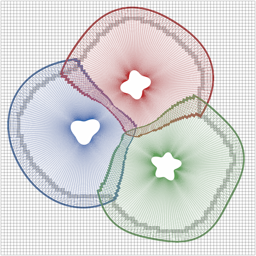

_(Looking for the older Fortran version? It's [here](https://github.com/majosm/overkit-fortran).)_

# Overkit

Overset meshes are a method for representing complex geometry in computational fluid dynamics
and other types of PDE-based simulations. An overset mesh is a composite mesh made up of a set
of overlapping component grids (structured or unstructured), in which the individual grids
exchange data with each other via interpolation.



Overset meshes have several nice properties, including:

1. **Simplicity:** Component grids are (often) structured, so operating on them is similar to
   operating on Cartesian grids
2. **Flexibility:** Overset meshes' modular nature make them convenient for moving geometry
   problems and adaptive mesh refinement, as well as simulations in which different physical
   phenomena or numerical methods are relevant in different regions
3. **Efficiency:** Structured grids enable the use of efficient and accurate numerical methods.

Overkit is designed to do two things:

1. Automate the tasks involved in transforming a set of overlapping grids into a working overset mesh.
2. Handle interpolation and data transfer between grids.

In addition to overset problems, Overkit can be employed for certain other applications involving
overlapping grids, such as mesh remapping (more on this below).

_Note:_ Overkit is currently designed for structured grids with node-centered data. Support for
cell-centered data and unstructured grids may be added in future versions.

# Installation

## Requirements

Overkit requires C++11 and C99 compilers, MPI, and CMake. It currently has no other mandatory third-party
library/tool dependencies.

## Building

Overkit uses CMake, so the build process is similar to that of other CMake-based build systems.
An example build procedure is:

```bash
  cd ~/overkit-src
  mkdir build && cd build
  cmake .. -DCMAKE_INSTALL_PREFIX=/usr/local/overkit
  make
  make install
```

See CMake's documentation for more details.

### Examples

Use the flag **`-DEXAMPLES=ON`** when configuring to build some example programs that use
Overkit. Source code for the examples can be found in `examples/`; the built programs are placed
in `<cmake-build-dir>/examples/`. Run `<example-program-name> --help` for information on how to
use each one.

### XDMF/HDF5

Some examples can write out grid files in XDMF format for visualization in tools such as ParaView.
This requires building with HDF5 support. HDF5 support will be automatically enabled if CMake can
find an HDF5 installation on your machine.

# C API

The documentation below uses Overkit's primary C++ API. However, a C API is also provided. See
`examples/InterfaceC.c` for an example that uses it.

# Overset basics and terminology

In an overset mesh, each component grid has **_fringes_** along its non-boundary edges. A
fringe is made up of one or more layers of **_receiver_** points, which are points that receive
data from other grids. Each receiver has a corresponding **_donor_** on the sending grid which
consists of the set of points that makes up the interpolation stencil and each point's
associated interpolation weight. Overkit calls the combination of a donor and a matching receiver
a **_connection_**. Most of the time, a pair of grids in an overset mesh will communicate in both
directions, so an interface between them will have two adjacent fringes (one on each grid).

In some cases when assembling an overset mesh, suitable donors may not be found for certain
receiver points (e.g. if there is insufficient overlap between grids); these receiver points
are referred to as **_orphan_** points.

Overset grids often have regions in which solutions are not computed called **_holes_**. These
result from several processes during assembly (details in the assembly section below).

# Data structures

Overkit has several main data structures along with a variety of auxiliary types.

## Context (`ovk::context`)

This is the top-level Overkit data structure. It is used to create the other Overkit data structures,
as well as to configure things like logging and error handling.

## Domain (`ovk::domain`)

A domain can be thought of as a set of grids along with a configurable set of add-on data components.

## Grid (`ovk::grid`)

Represents a component grid. Stores the grid's metadata (size, local range, periodicity, etc.).

## Assembler (`ovk::assembler`)

Performs overset assembly.

## Exchanger (`ovk::exchanger`)

Handles intergrid data exchange.

## Domain components

### Geometry component (`ovk::geometry_component`)

Stores grid geometry data. Contains a set of `ovk::geometry` objects.

#### Geometry (`ovk::geometry`)

Stores coordinates for a grid and certain derived quantities such as cell volumes.

### State component (`ovk::state_component`)

Stores grid point state data. Contains a set of `ovk::state` objects.

#### State (`ovk::state`)

Stores an array of flags describing properties of a grid's points (active, hole, fringe, etc.)

### Overlap component (`ovk::overlap_component`)

Stores pairwise overlap data. Contains a set of `ovk::overlap_m` and `ovk::overlap_n` objects.

#### Overlap M (`ovk::overlap_m`)

Stores cell-side overlap data for a grid pair. Contains the following data for each overlapping cell:

1. _Cell:_ the (i,j,k) indices of the cell.
2. _Coordinates:_ the isoparametric coordinates of the overlapped point inside the cell (i.e.,
   the coordinates of the point after mapping the cell to the unit box [0,1]^n).
3. _Destination:_ the corresponding overlapped point.
4. _Destination rank:_ the MPI rank containing the overlapped point.

#### Overlap N (`ovk::overlap_n`)

Stores point-side overlap data for a grid pair. Contains the following data for each overlapped
point:

1. _Point:_ the (i,j,k) indices of the point.
2. _Source:_ the corresponding overlapping cell.
3. _Source rank:_ the MPI rank containing the overlapping cell.

### Connectivity component (`ovk::connectivity_component`)

Stores pairwise connectivity data. Contains a set of `ovk::connectivity_m` and `ovk::connectivity_n`
objects.

#### Connectivity M (`ovk::connectivity_m`)

Stores cell-side connectivity data for a grid pair. Contains the following data for each donor:

1. _Extents:_ the range of points from which data will be interpolated. Stored as a 2D array, with
   the first index indicating begin (0) or end (1) and the second indicating the dimension.
   (_Note:_ the end point is not considered part of the interval.)
2. _Interpolation coefficients:_ the interpolation weights for each point in the interpolation
   stencil, in tensor product format. Stored as a 2D array, with the first index indicating
   the dimension and the second indicating the point in the stencil.
3. _Coordinates:_ the isoparametric coordinates of the receiver point inside the donor stencil.
   The coordinate range will depend on the interpolation scheme; for example, linear interpolation
   maps to [0,1]^n and cubic interpolation maps to [-1,2]^n).
4. _Destination:_ the corresponding receiver point.
5. _Destination rank:_ the MPI rank containing the receiver point.

#### Connectivity N (`ovk::connectivity_n`)

Stores point-side connectivity data for a grid pair. Contains the following data for each receiver:

1. _Point:_ the (i,j,k) indices of the point.
2. _Source:_ the lower corner of the corresponding donor cell.
3. _Source rank:_ the MPI rank containing the lower corner of the donor cell.

## Auxiliary types

### Array types (`ovk::array`, `ovk::array_view`, `ovk::field`, `ovk::field_view`, `ovk::distributed_field`)

`ovk::array<T,N,Layout>` is a dynamically-sized array of element type `T`, rank `N` (default 1), and
memory layout `Layout` (default `ovk::array_layout::ROW_MAJOR`).

`ovk::array_view<T,N,Layout>` is a pointer-like object that points to an array (not limited to
`ovk::array`) of element type `T`, rank `N` (default 1), and memory layout `Layout` (default
`ovk::array_layout::ROW_MAJOR`).

`ovk::field<T>` is an alias of `array<T,3,ovk::array_layout::COLUMN_MAJOR>`.

`ovk::field_view<T>` is an alias of `array_view<T,3,ovk::array_layout::COLUMN_MAJOR>`.

`ovk::distributed_field<T>` is an object that represents a field distributed over a set of processors.

### Optional (`ovk::optional`)

`ovk::optional<T>` is an object that may or may not contain an object of type `T`. It is a stand-in
for `std::optional`, which is not supported in C++11.

# Basic setup

## Context creation

A context is needed before doing anything else with Overkit. Contexts are created as follows:

```C++
ovk::context Context = ovk::CreateContext(ovk::context::params()
  .SetComm(<comm>)
  .SetErrorLogging(<errorlogging>)
  .SetWarningLogging(<warninglogging>)
  .SetStatusLoggingThreshold(<statusthreshold>)
  .SetProfiling(<profiling>)
);
```

`<comm>` is the MPI communicator on which the context exists.

`<errorlogging>` and `<warninglogging>` are boolean values indicating whether error/warning messages
should be written to the command line. Errors mean Overkit has encountered a problem and must stop.
Warnings indicate non-critical issues. _(optional; default=`true`)_

`<statusthreshold>` is a nonnegative integer value indicating status log verbosity. A value of `0`
indicates no logging, and larger values produce more status output. _(optional; default=`1`)_

`<profiling>` is a boolean value that enables or disables collection of performance profiling data.
This data can be retrieved using the `WriteProfile()` member function. _(optional; default=`false`)_

Most other Overkit objects share ownership of the context, so typically you will want to store it
inside a `std::shared_ptr`:
```C++
auto Context = std::make_shared<ovk::context>(ovk::CreateContext(ovk::context::params()
  ...
));
```
  
## Domain creation

Domains are created as follows:

```C++
ovk::domain Domain = ovk::CreateDomain(Context, ovk::domain::params()
  .SetName(<name>)
  .SetDimension(<numdims>)
  .SetComm(<comm>)
);
```

`Context` is the `std::shared_ptr<ovk::context>` mentioned above.

`<name>` is the name of the domain to be used in logging. _(optional; default=`"Domain"`)_

`<numdims>` is the dimension of the domain (1, 2, or 3).

`<comm>` is the MPI communicator on which the domain exists.

## Grid creation

Grids are created in one of two ways:

#### Method #1 (single grid):
```C++
int GridID = 1; // IDs must be nonnegative
ovk::optional<ovk::grid::params> MaybeGridParams;
if (<Grid is local>) {
  MaybeGridParams = ovk::grid::params()
    .SetName(<name>)
    .SetDimension(<numdims>)
    .SetComm(<comm>)
    .SetGlobalRange(<globalrange>)
    .SetLocalRange(<localrange>)
    .SetPeriodic(<periodic>)
    .SetPeriodicStorage(<periodicstorage>);
}
Domain.CreateGrid(GridID, MaybeGridParams);
```

#### Method #2 (multiple grids):
```C++
int GridIDs[] = {1, 2}; // Can also be std::array, std::vector, etc.
ovk::optional<ovk::grid::params> MaybeGridParams[2]; // Same here
if (<Grid 1 is local>) {
  MaybeGridParams[0] = ovk::grid::params()
    ...;
}
if (<Grid 2 is local>) {
  MaybeGridParams[1] = ovk::grid::params()
    ...;
}
Domain.CreateGrids(GridIDs, MaybeGridParams);
```

`CreateGrid` or `CreateGrids` must be called on the entire domain communicator, so Method #2 is
preferable when creating multiple grids at once as it avoids serializing grid creation.

`<name>` is the name of the grid to be used in logging. _(optional; default=`"Grid"`)_

`<numdims>` is the dimension of the grid (must match domain dimension).

`<comm>` is the MPI communicator on which the grid exists.

`<globalrange>` is the global (i,j,k) index range of the grid points. If the grid indices start at
0, can be specified as `{<globalsize>}`, where `<globalsize>` is an array containing the sizes in each
dimension. Otherwise, it can be specified as `{<globalbegin>,<globalend>}`, where `<globalbegin>` and
`<globalend>` are arrays indicating the start and end indices in each dimension (the endpoint is not
included in the range).

`<localrange>` is the index range of the grid points owned by the local processor. It can be set
analogously to `<globalrange>`.

`<periodic>` is an array of boolean values indicating whether or not the grid is periodic in each
dimension. _(optional; default=`false` for all dimensions)_.

`<periodicstorage>` can either be **`ovk::periodic_storage::UNIQUE`** or
**`ovk::periodic_storage::DUPLICATED`**. The former indicates that the grid contains only one instance
of each point along any of its periodic dimensions; the latter indicates that the first point is 
duplicated at the end in any periodic dimension. _(optional; default=`ovk::periodic_storage::UNIQUE`)_.

Grids can also be destroyed:

#### Method #1:
```C++
Domain.DestroyGrid(1);
```
  
#### Method #2:
```C++
int GridIDs[] = {1, 2};
Domain.DestroyGrids(GridIDs);
```

## Domain component creation

Domain components are created as follows (using `ovk::geometry_component` as an example):

```C++
int ComponentID = 1; // IDs must be nonnegative
Domain.CreateComponent<ovk::geometry_component>(ComponentID, ovk::geometry_component::params()
  .SetName(<name>)
);
```

`<name>` is the name of the component to be used in logging. _(optional;
default=`"GeometryComponent"`, etc.)_

_Note 1:_ If not specifying any parameters, parameter objects can be omitted entirely.

_Note 2:_ Domains can contain multiple components of the same type.

Components can also be destroyed:

```C++
Domain.DestroyComponent<ovk::geometry_component>(1);
```

# Overset assembly

## Domain configuration

When setting up a domain for assembly, four components are required: geometry, state, overlap,
and connectivity.

### Geometry

Overkit needs to know the coordinates of all of the grid points.

```C++
Domain.CreateComponent<ovk::geometry_component>(1);
{
  // Request to edit the geometry component
  auto GeometryComponentHandle = Domain.EditComponent<ovk::geometry_component>(1);
  ovk::geometry_component &GeometryComponent = *GeometryComponentHandle;
  // Create the geometry objects
  std::vector<ovk::optional<ovk::geometry::params>> MaybeGeometryParams(NumGrids);
  for (<each local grid>) {
    MaybeGeometryParams[iGrid] = ovk::geometry::params()
      .SetType(<geometrytype>)
      .SetPeriodicLength(<periodiclength>);
  }
  GeometryComponent.CreateGeometries(GridIDs, MaybeGeometryParams);
  for (<each local grid>) {
    // Request to edit the geometry object
    auto GeometryHandle = GeometryComponent.EditGeometry(GridID);
    ovk::geometry &Geometry = *GeometryHandle;
    // Request to edit the coordinates
    auto CoordsHandle = GeometryHandle->EditCoords();
    ovk::array<ovk::distributed_field<double>> &Coords = *CoordsHandle;
    for (int iDim = 0; iDim < NumDims; ++iDim) {
      for (<each dimension iDim and each point (i,j,k) in grid local range>) {
        Coords(iDim)(i,j,k) = <coord>;
      }
    }
  }
}   
```

`<geometrytype>` can be used to provide hints about whether the grid's coordinates have
any special properties that can be used to improve performance. Possible values are:

* **`ovk::geometry_type::UNIFORM`** - an axis-aligned uniformly-spaced grid
* **`ovk::geometry_type::ORIENTED_UNIFORM`** - a rotated uniform grid
* **`ovk::geometry_type::RECTILINEAR`** - a non-uniform grid in which all of the cells are
  rectangular and axis-aligned
* **`ovk::geometry_type::ORIENTED_RECTILINEAR`** - a rotated rectilinear grid
* **`ovk::geometry_type::CURVILINEAR`** - a general non-uniform structured grid.

_(optional; default=`ovk::geometry_type::CURVILINEAR`)_.

`<periodiclength>` specifies the offset that must be applied to the grid's coordinates when crossing
over from one period to the next in any periodic dimensions. The length can be set to 0.0 for O-shaped
grids. _Note:_ Overkit currently assumes that only the corresponding dimension's coordinate changes
when crossing periods, e.g., if crossing from point (i,N-1,k) to (i,0,k), the X and Z coordinates will
remain the same, and the Y coordinate will be offset by PeriodicLength[1]. _(optional; default=0.0 for
all dimensions)_

_Note:_ Grid coordinates are initially set to their corresponding (i,j,k) index values.

### State

Overkit may need to know certain details about each grid point.

```C++
Domain.CreateComponent<ovk::state_component>(2);
{
  auto StateComponentHandle = Domain.EditComponent<ovk::state_component>(STATE_ID);
  ovk::state_component &StateComponent = *StateComponentHandle;
  StateComponent.CreateStates(GridIDs);
  for (<each local grid>) {
    // Request to edit the state
    auto StateHandle = StateComponent.EditState(GridID);
    ovk::state &State = *StateHandle;
    // Request to edit the state flags
    auto FlagsHandle = State.EditFlags();
    ovk::distributed_field<ovk::state_flags> &Flags = *FlagsHandle;
    for (<each point (i,j,k) in grid local range>) {
      Flags(i,j,k) = <flags>;
    }
  }
}
```
  
`<flags>` is a bit mask indicating the state of the given point. User-configurable bits are:

* **`ovk::state_flags::ACTIVE`** - whether the point is active (normal point) or not (hole point)
* **`ovk::state_flags::DOMAIN_BOUNDARY`** - a point that lies along a boundary of the simulation domain
* **`ovk::state_flags::INTERNAL_BOUNDARY`** - a point along a grid edge that isn't a domain boundary, but
  where a fringe is undesirable (perhaps due to the presence of some other type of intergrid
  interface)
  
_Note:_ Overkit expects valid grid coordinates for all points, even those marked inactive.

### Overlap and Connectivity

Overkit fills in the overlap and connectivity data during assembly. The user must merely create
the components:

```C++
Domain.CreateComponent<ovk::overlap_component>(3);
Domain.CreateComponent<ovk::connectivity_component>(4);
```

## Running assembly

As mentioned above, the `ovk::assembler` object performs overset assembly. In order to do so, it
must be created and bound to a domain.

```C++
ovk::assembler Assembler = ovk::CreateAssembler(Context);
Assembler.Bind(Domain, ovk::assembler::bindings()
  .SetGeometryComponentID(1)
  .SetStateComponentID(2)
  .SetOverlapComponentID(3)
  .SetConnectivityComponentID(4)
);
```

After this, assembly options can be set:

```C++
{
  auto OptionsHandle = Assembler.EditOptions();
  ovk::assembler::options &Options = *OptionsHandle;
  Options.Set<pairwiseoptionname>({<mgridid>,<ngridid>}, <value1>);
  Options.Set<gridwiseoptionname>(<gridid>, <value2>);
  ...
}
```

`<mgridid>`, `<ngridid>`, and `<gridid>` can be either a grid ID or `ovk::ALL_GRIDS`.

The types of `<value1>` and `<value2>` will depend on the option being set.

And finally assembly can be run: 

```C++
Assembler.Assemble();
```

The sections below describe the assembly process in Overkit and explain the function of each assembly
option.

### Overlap detection

Overkit first needs to determine how the component grids are situated with respect to each other.
This consists of looking at every grid point and determining within which cell(s) on the other grids
the point resides (if any). Naively, overlap detection has quadratic computational complexity in the
number of grid points (because it involves testing each point against each cell among all pairs of
grids), but this can be improved to linear complexity through the use of spatial partitioning data
structures.

Overkit's approach involves first performing a distributed partition bounding box collision to quickly
prune down the number of potentially-overlapping ranks. Once this is completed, potentially-overlapping
ranks communicate with each other directly, streaming in coordinate data for further computation.
As these pieces of grid data are received, spatial partitioning data structures are constructed and
local points are queried in order to determine whether any overlap exists. Currently this local spatial
partitioning structure consists of a coarse-grained kd-tree (primarily to eliminate empty space) and a
set of finer-grained spatial hash grids.
  
Relevant options:

* **`Overlappable(m,n)`** - whether grid `m`'s cells are considered to potentially overlap grid `n`'s
  points _(default=`false`)_
* **`OverlapTolerance(m,n)`** - tolerance for points on grid `n` that lie slightly outside of grid
  `m` but should be considered to overlap (most often occurs along curved boundaries). Specified as
  a fraction of the boundary cells' sizes (e.g. a value of 0.1 means that a point can be up to 10%
  outside of a nearby cell and still be considered to overlap) _(default=0.0)_
* **`OverlapAccelDepthAdjust(m)`** - adjusts the desired minimum number of cells in each kd-tree
  node on grid `m`. Each increment by 1.0 halves the number (increasing the tree depth), and each
  decrement by 1.0 doubles the number (decreasing the tree depth) _(default=0.0)_
* **`OverlapAccelResolutionAdjust(m)`** - adjusts the size of hash grid bins on grid `m`. Each
  increment by 1.0 halves the bin size (resulting in fewer cells overlapping with each bin,
  i.e., better performance at the cost of more memory) and each decrement by 1.0 doubles the
  bin size _(default=0.0)_.

### Boundary hole cutting

The collection of domain boundary points on all of the grids defines the overall shape of the
domain. Depending on the input grid configuration, some points may lie outside of this region and
will need to be removed. (For example, in a two-grid airfoil configuration with a uniform background
grid and a second grid that wraps around the airfoil geometry, points on the background grid will
lie inside the non-domain region defined by inner edge of the second grid.)

Overkit handles this by (1) projecting a representation of other grids' boundaries onto the grid
being cut, (2) detecting which side is outside of the domain, then (3) flooding this side and
removing the detected points from the domain.

Relevant options:

* **`InferBoundaries(n)`** - assume grid edges in non-overlapping regions are domain boundaries on
  grid `n` _(default=false)_
* **`CutBoundaryHoles(m,n)`** - whether the boundary points on grid `m` are allowed to be used in
  cutting grid `n` _(default=false)_.

### Receiver selection

Next we need to determine which points should be receiving data. Overkit divides the points detected
in this step into two categories, _**outer fringe**_ points and _**occluded**_ points. Outer fringe
points are points near non-boundary grid edges. Occluded points are overlapped points for which one
of the overlapping grids has been determined to be a better representation of that part of the
domain than the present one.

Relevant options:

* **`FringeSize(n)`** - how many layers of points away from non-boundary edges of grid `n` should be
  counted as fringe _(default=0)_
* **`Occludes(m,n)`** - how to treat points on grid `n` that are overlapped by grid `m`. Possible
  values are **`ovk::occludes::ALL`**, meaning all such points are occluded, **`ovk::occludes::NONE`**,
  meaning none are occluded, and **`ovk::occludes::COARSE`**, meaning only points with a lower
  resolution are occluded _(default=`ovk::occludes::NONE`)_
* **`EdgePadding(m,n)`** - in some cases it may be desirable to prevent points from receiving data
  from points that are within some distance of the donor grid's edge. This option specifies how
  far from the edge cells should be on the overlapping grid `m` in order to occlude points on the
  overlapped grid `n` _(default=0)_
* **`EdgeSmoothing(n)`** - used in conjunction with `EdgePadding`, helps to remove any sharp edges
  or disconnectedness in the set of occluded points on grid `n`. Higher values increase smoothing
  strength _(default=0)_.

### Overlap minimization

For overset meshes we typically don't need to keep all of the receiver points detected in the
previous step. Instead we can cut out most of the occluded points and leave only the few layers
nearest to the unoccluded part of the grid. Overkit calls these remaining points the _**inner
fringe**_.

The `EdgePadding` option described in the previous section reduces the size of a grid's occluded
region, which has the side effect of increasing the amount of overlap remaining after overlap
minimization. More on this in the data exchange section below.

Relevant options:

* **`MinimizeOverlap(m,n)`** - whether points on grid `n` that are occluded by grid `m` and aren't
  part of the inner fringe should be removed _(default=`false`)_
* **`FringeSize(n)`** - (defined above)
* **`EdgePadding(m,n)`** - (defined above).

### Donor selection

By this point we have our final set of receiver points and the only thing left to do is to locate
the corresponding donors. This involves choosing which overlapping grid will donate to each receiver
and then actually generating the interpolation stencils on the donor grids. In determining the
best donor grid for a given receiver, both the local grid resolution and edge distance are used.
If a suitable donor cannot be found, the point will be marked as an orphan and a warning will be
emitted.

Relevant options:

* **`ConnectionType(m,n)`** - how donors on grid `m` will communicate with receivers on grid `n`.
  Possible values are **`ovk::connection_type::NONE`**, meaning communication is not allowed, and
  **`ovk::connection_type::NEAREST`**, **`ovk::connection_type::LINEAR`**, and
  **`ovk::connection_type::CUBIC`** for nearest-neighbor, linear, and cubic interpolation respectively
  _(default=`ovk::connection_type::NONE`)_. _Note:_ Cubic interpolation is not yet supported.
* **`EdgePadding(m,n)`** - (defined above; used again here as a threshold for deciding whether to
  prioritize edge distance or resolution)
* **`DisjointConnections(m,n)`** - disallow donors whose vertices contain receiver points
  _(default=`true`)_.
  
## Troubleshooting assembly

Occasionally after running overset assembly, you may get a result that doesn't match what you expected.
In these instances it can be helpful to look at the intermediate results of the steps described
above. For this purpose Overkit records some of these results in the state flags.

Currently-supported assembly state flags are:

* **`ovk::state_flags::OVERLAPPED`** - point is overlapped by another grid
* **`ovk::state_flags::INFERRED_DOMAIN_BOUNDARY`** - point is a domain boundary that was detected during
  boundary inference
* **`ovk::state_flags::BOUNDARY_HOLE`** - point was removed during boundary hole cutting
* **`ovk::state_flags::OCCLUDED`** - point is occluded by another grid
* **`ovk::state_flags::FRINGE`** - point is part of the fringe
* **`ovk::state_flags::OUTER_FRINGE`** - point is part of the outer fringe
* **`ovk::state_flags::INNER_FRINGE`** - point is part of the inner fringe
* **`ovk::state_flags::OVERLAP_MINIMIZED`** - point was removed during overlap minimization
* **`ovk::state_flags::RECEIVER`** - point is a receiver
* **`ovk::state_flags::ORPHAN`** - point was a receiver but no suitable donors were found.

# Mesh remapping

A similar procedure to overset assembly can be employed to handle mesh remapping (i.e., interpolation of
all data from one collection of grids to another). For this application one would create a single domain
containing both the source and destination grids, and set assembly options as follows:

* `Overlappable(<srcgrids>,<destgrids>)=true`
* `Occludes(<srcgrids>,<destgrids>)=ovk::occludes::ALL`
* `ConnectionType(<srcgrids>,<destgrids>)=<desired interp scheme>`.

(Omitted are options such as `OverlapTolerance` which may or may not be needed depending on the geometry.)

# Connectivity data import

Connectivity data can be manually imported into Overkit. See `examples/Interface.cpp` for an example of
this being done.

# Data exchange

Once connectivity data has been created or imported, one would like to be able to use it to transfer data
between grids. `ovk::exchanger` facilitates this. It is created similarly to `ovk::assembler`:

```C++
ovk::exchanger Exchanger = ovk::CreateExchanger(Context);
Exchanger.Bind(Domain, ovk::exchanger::bindings()
  .SetConnectivityComponentID(4)
);
```

However, unlike the assembler it only requires a connectivity component.

Intergrid data exchange is currently broken up into 4 steps:

1. **Collect** - Grid buffer data is interpolated on the donor side and packed into send buffers
2. **Send/Receive** - Non-blocking sends and receives are initialized
3. **Wait** - Block until sends and receives have completed
4. **Disperse** - Unpack data on receiver side into grid buffers

For this exchange paradigm to work, it is important that for any given grid the set of points
donating to other grids and the set of points receiving from other grids are disjoint. This is
ensured by leaving the `DisjointConnections` assembly option enabled and adding enough
`EdgePadding` such that no orphans remain. It may be possible to create overset meshes with less
overlap by running something like the above exchange procedure as an iterative scheme, but this
has not been tested.

## Creating an exchange

The code below sets up a one-way exchange between two grids:

```C++
if (<grid 1 is local>) {
  int CollectID = 1;
  Exchanger.CreateCollect({1,2}, CollectID, <collectop>, <valuetype>, <count>, <gridbufferrange>,
    <gridbufferlayout>);
  int SendID = 1;
  Exchanger.CreateSend({1,2}, SendID, <valuetype>, <count>, <tag>);
}
if (<grid 2 is local>) {
  int ReceiveID = 1;
  Exchanger.CreateReceive({1,2}, ReceiveID, <valuetype>, <count>, <tag>);
  int DisperseID = 1;
  Exchanger.CreateDisperse({1,2}, DisperseID, <disperseop>, <valuetype>, <count>,
    <gridbufferrange>, <gridbufferlayout>);
}
```

(Typically, data exchange will go in both directions. See `examples/Interface.cpp` for a more
realistic example.)

`<collectop>` specifies how the donor vertex data should be processed to give a single value that
can be transferred to the corresponding receiver. Possible values are:

* **`ovk::collect_op::INTERPOLATE`** - interpolate the vertex data using the stored weights
* **`ovk::collect_op::NONE`** - send `true`/`1` if none of the vertex values evaluate to `true`
* **`ovk::collect_op::ANY`** - send `true`/`1` if any of the vertex values evaluate to `true`
* **`ovk::collect_op::NOT_ALL`** - send `true`/`1` if not all of the vertex values evaluate to `true`
* **`ovk::collect_op::ALL`** - send `true`/`1` if all of the vertex values evaluate to `true`.

`<valuetype>` specifies the type of the data. Possible values are:

* **`ovk::data_type::BOOL`**
* **`ovk::data_type::BYTE`**
* **`ovk::data_type::INT`**
* **`ovk::data_type::LONG`**
* **`ovk::data_type::LONG_LONG`**
* **`ovk::data_type::INT32`**
* **`ovk::data_type::INT64`**
* **`ovk::data_type::UNSIGNED_INT`**
* **`ovk::data_type::UNSIGNED_LONG`**
* **`ovk::data_type::UNSIGNED_LONG_LONG`**
* **`ovk::data_type::UNSIGNED_INT32`**
* **`ovk::data_type::UNSIGNED_INT64`**
* **`ovk::data_type::FLOAT`**
* **`ovk::data_type::DOUBLE`**.

`<count>` specifies the number of values that will be sent per donor/receiver.

`<gridbufferrange>` specifies the extents of the grid buffer used as a source for collecting and
as a destination for dispersing. It is set in a similar fashion to the grid global and local
ranges above.

`<gridbufferlayout>` specifies the memory layout of the grid buffer (`ovk::array_layout::ROW_MAJOR` or
`ovk::array_layout::COLUMN_MAJOR`).

`<tag>` is used for matching sends and receives in instances where several may be active at once.
_Note:_ Only sends/receives with the same grid pair specification may potentially match.

`<disperseop>` specifies how received data should be unpacked. Possible values are:

* **`ovk::disperse_op::OVERWRITE`** - replace grid buffer value with received value
* **`ovk::disperse_op::APPEND`** - add received value to existing grid buffer value.

## Running exchange

Once an exchange is defined, it can be executed in a number of ways. Here is one such way:

```C++
// Create buffers for packed data
auto &ConnectivityComponent = Domain.Component<ovk::connectivity_component>(4);
std::vector<double> DonorValues;
std::vector<double> ReceiverValues;
if (<grid 1 is local>) {
  const ovk::connectivity_m &ConnectivityM = ConnectivityComponent.ConnectivityM({1,2});
  DonorValues.resize(ConnectivityM.Size());
}
if (<grid 2 is local>) {
  const ovk::connectivity_n &ConnectivityN = ConnectivityComponent.ConnectivityN({1,2});
  ReceiverValues.resize(ConnectivityN.Size());
}

// Sends and receives are non-blocking, so they create request objects much like MPI
std::vector<ovk::request> Requests;

// Post receive
if (<grid 2 is local>) {
  double *ReceiverValuesPtr = ReceiverValues.data();
  ovk::request Request = Exchanger.Receive({1,2}, <receiveid>, &ReceiverValuesPtr);
  Requests.push_back(std::move(Request));
}

// Collect and post send
if (<grid 1 is local>) {
  const double *BufferPtr = <gridbufferptr>;
  double *DonorValuesPtr = DonorValues.data();
  Exchanger.Collect({1,2}, <collectid>, &BufferPtr, &DonorValuesPtr);
  ovk::request Request = Exchanger.Send({1,2}, <sendid>, &DonorValuesPtr);
  Requests.push_back(std::move(Request));
}

// Wait for send and receive to complete
ovk::WaitAll(Requests);

// Disperse
if (<grid 2 is local>) {
  const double *ReceiverValuesPtr = ReceiverValues.data();
  double *BufferPtr = <gridbufferptr>;
  Exchanger.Disperse({1,2}, <disperseid>, &ReceiverValuesPtr, &BufferPtr);
}
```

Analogous to MPI, `ovk::WaitAny` and `ovk::WaitSome` are also provided.

# Citing

(Will add this when I do a 1.0 release.)

# Acknowledgements

Overkit is one of several software projects produced by the University of Illinois Center for
Exascale Simulation of Plasma-Coupled Combustion (XPACC): <http://xpacc.illinois.edu>.

This material is based in part upon work supported by the Department of Energy, National Nuclear
Security Administration, under Award Number DE-NA0002374.
